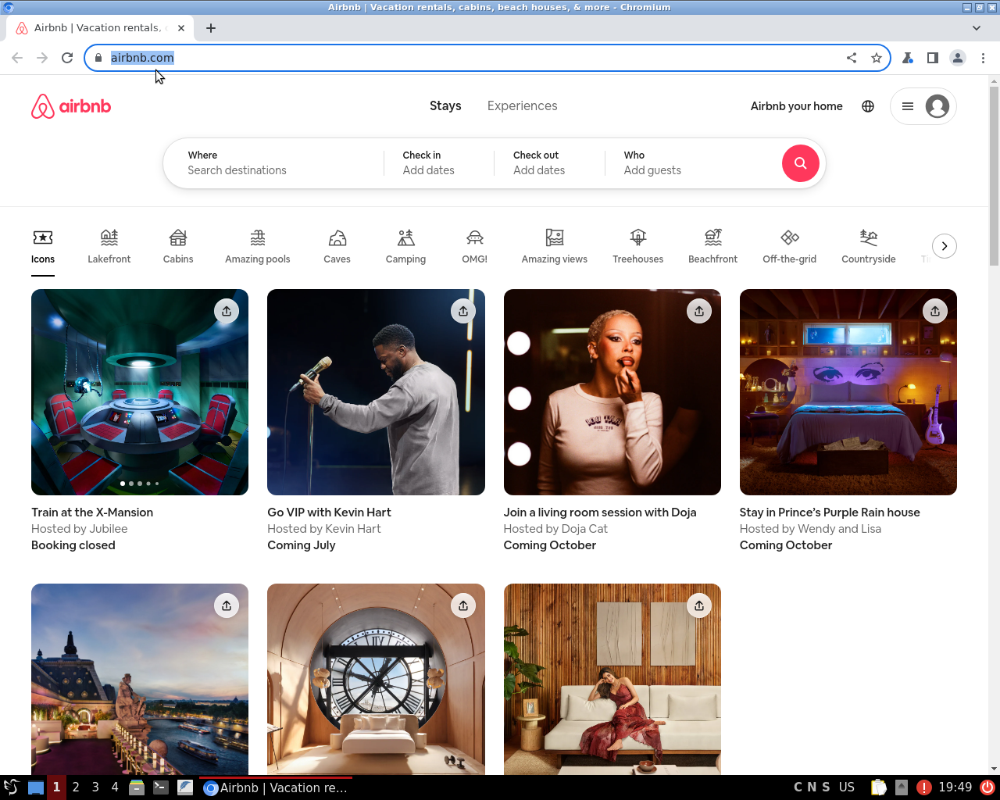

# Conversations and Images

## ID: 0b0d60d3-9641-4eba-ba04-ba30a6608b55

### Image

### Conversations
**User:** "<ImageHere> I've provided you with an image of a desktop UI. We are trying to test this webpage, please randomly select a way you can change the environment through clicking.
For example if you want to open the user settings simply return "open user settings", if you want to highlight the search bar so you can type in it simply return "highlight search bar".
"

**Assistant:** "Sure, let's go with this action:

"highlight search bar""

## ID: 3c9a5beb-7a1d-4cda-abd4-4cd1b87970a6

### Image

### Conversations
**User:** "<ImageHere> return the mouse coordinates for the GUI image of size [1280, 1024] in the form [x, y]"

**Assistant:** "[200, 90]"

## ID: 8a434ffa-fc99-461e-bf35-37d2c187dda3

### Image

### Conversations
**User:** "<ImageHere> I've provided you with an image of an ubuntu desktop GUI with the size [1280, 1024]. In detail, predict the state of the screen after you click the mouse at its current coordinates [200, 90]"

**Assistant:** "The mouse cursor is focused in the URL address bar with the text "airbnb.com" highlighted."

## ID: a6206b4b-7ba3-405c-8272-95a0b27452dc

### Image

### Conversations
**User:** "I've provided you with two images of a desktop GUI, first is an image of the state of the GUI before the mouse was clicked. 
The second image is an image of the state of the GUI after the mouse was clicked. Please describe the current state of the screen in detail, paying attention to any changes in the screen that may have occured from the click. 
This will be used to train a world model, so please return the response in a form that only describes the changes in the screen e.g. 'A login screen where the user can input their credentials or use social login' 
or if there is no difference in the images then simple return 'no change'."

**Assistant:** "The mouse cursor is focused in the URL address bar with the text "airbnb.com" highlighted."

## ID: 4243232a-c5cc-4082-bcab-d36fd7dd0b5a

### Image

### Conversations
**User:** "<ImageHere> I've provided you with an image of a desktop UI. We are trying to click the screen in the right location which will cause the following environment change: 'The mouse cursor is focused in the URL address bar with the text "airbnb.com" highlighted.'.
The current mouse coordinates are [640, 512]. Please return the new coordinates in the form [x, y]. For example if we need to open the user settings and the user button is located at (450, 740) we would return [450, 740].
    "

**Assistant:** "[200, 90]"

## ID: 7c9d78cb-f445-44a4-9ec7-2ec57eea5b69

### Image

### Conversations
**User:** "<ImageHere> I've provided you with an image of an ubuntu desktop GUI with a chromium browser open. What URL is the browser currently navigated to?"

**Assistant:** "airbnb.com"

